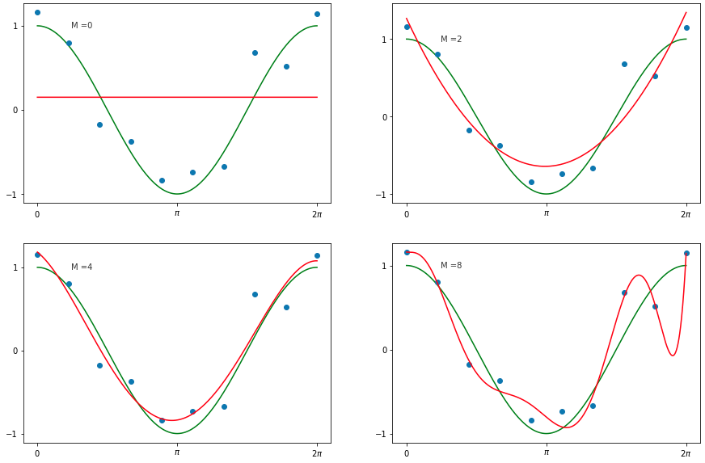

# Machine-Learning-1

Code and Solution for the labs and homework assignments for Machine Learning 1 course offered in MSc. in Artificial Intelligence at the University of Amsterdam.

### Lab 1- Linear Regression and Overfitting

__KeyWords__: Polynomial Regression, Regularization, k-Fold cross validation, Bayesian linear regression

[Solutions](ml_lab/lab1)

   
  <i>Manifold learned by the VAE</i>
   
 

