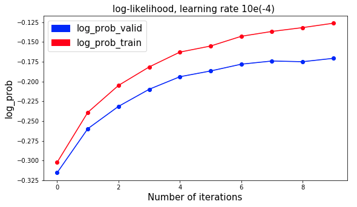
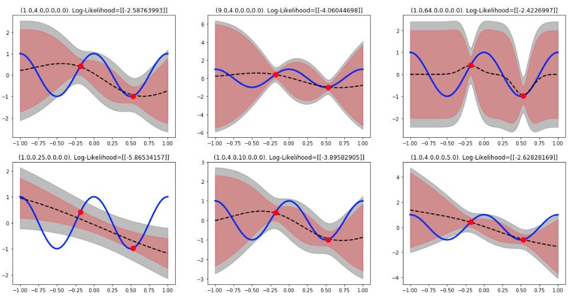
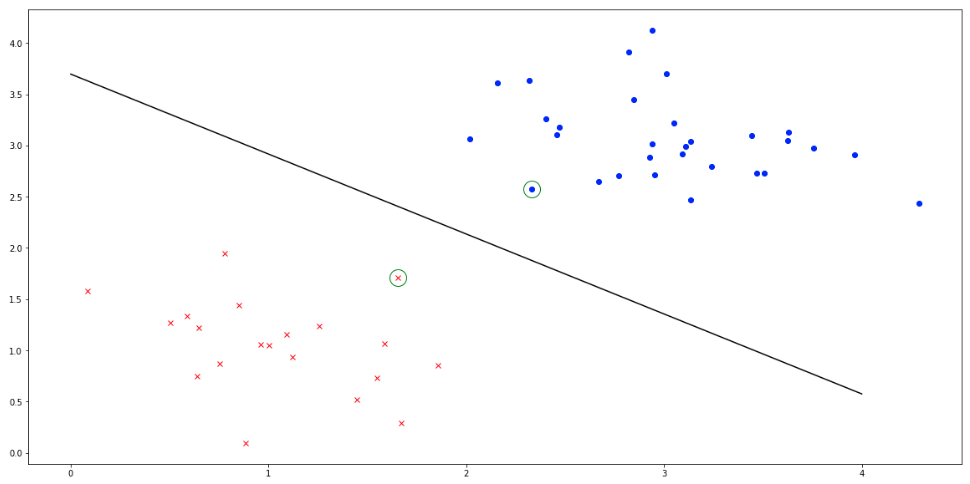

# Machine-Learning-1

Code and Solution for the labs and homework assignments for Machine Learning 1 course offered in MSc. in Artificial Intelligence at the University of Amsterdam.

### Lab 1- Linear Regression and Overfitting

__KeyWords__: Polynomial Regression, Regularization, k-Fold cross validation, Bayesian linear regression

[Solutions](ml_lab/lab1.ipynb)

   
  <i>Polynomial Regression</i>
   
 

 
 ### Lab 2- Classification
 
 __KeyWords__: Multiclass logistic regression, Stochastic gradient descent, Multilayer perceptron, MAP optimization
 
 [Solutions](ml_lab/lab2.ipynb)
 

   
  <i>Log-likelihood convergence</i>
   
 

 
 ### Lab 3- Gaussian Processes and Support Vector Machines
 
  [Solutions](ml_lab/lab3.ipynb)
  
  

   
  <i>Manifold learned by the VAE</i>
   
   
   
  <i>Interpolation results from GAN </i>

